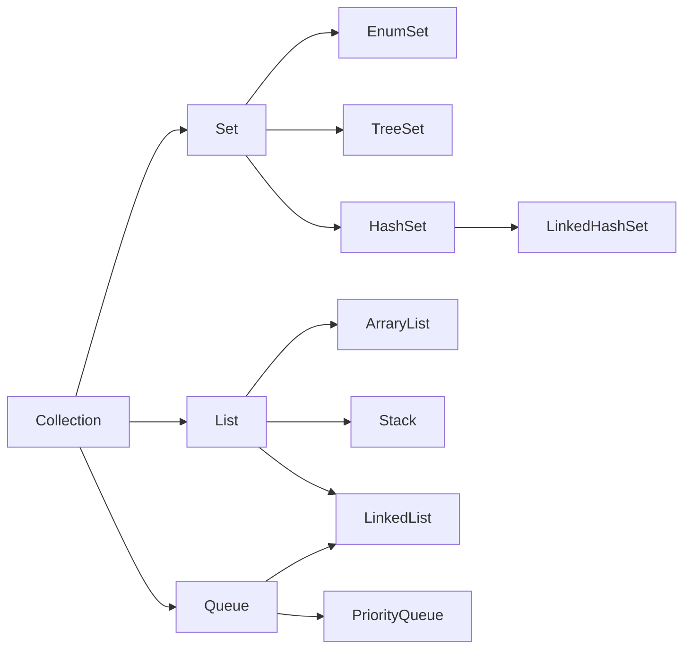
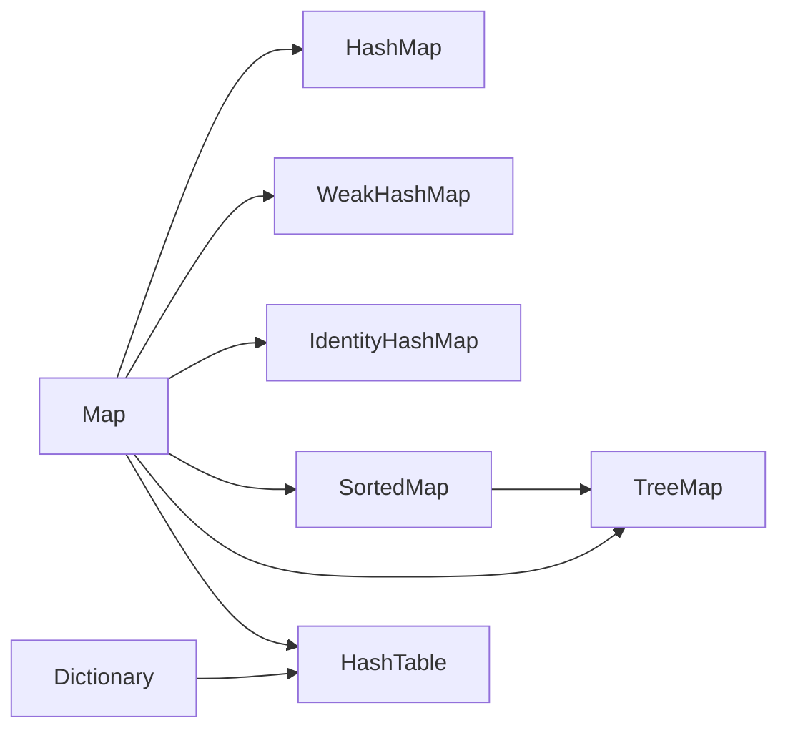

# java数据结构

by 菲尼莫斯 2019年3月16日

---

## 集合

## 集合常用方法

* 新版本java中推荐使用arrayList代替Vector集合，并可以使用同步线程包装器把arrayList变为线程安全的

* 查找
    * int size()
    * boolean isEmpty()
    * boolean contains(obj)：是否包含某个对象
    * boolean contains(collection)：是否包含某集合的所有元素

* 修改
    * boolean add(obj)
    * boolean addAll(collection)
    * boolean remove(obj)
    * boolean clear()：删除全部
    * boolean removeAll(collection)
    * boolean retainAll(collection)：保留参数集合中的所有内容，删除其他

* 其他
  * sort：需实现comparator接口
  * shuffle：打乱所有元素
  * reverse：反转
  * fill：把数组某一段填充为某一个值
  * copy：将目标集合复制覆盖到源集合的相应元素
  * min、max：需实现comparator接口

## 集合遍历

* Iterator 接口（enumeration已过时）
  * hasNext()
  * next()
  * remove()：去除最后调用next()的元素

## Map

* 装填因子：填入的项数/表的容量，越高越容易发生冲突

* HashMap会自动根据容量和装填因子扩容

* HashMap的默认容量为10，装填因子为0.75

* list的默认容量是10？

