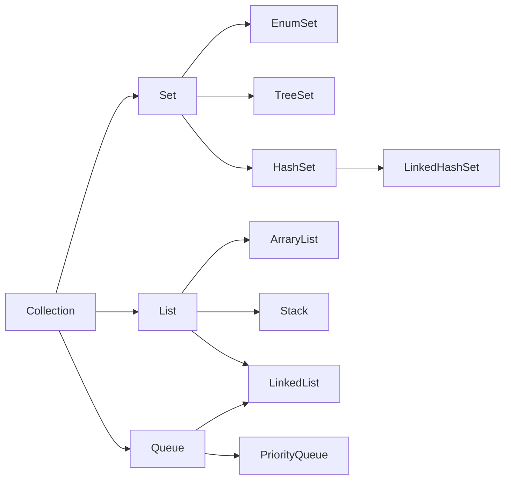
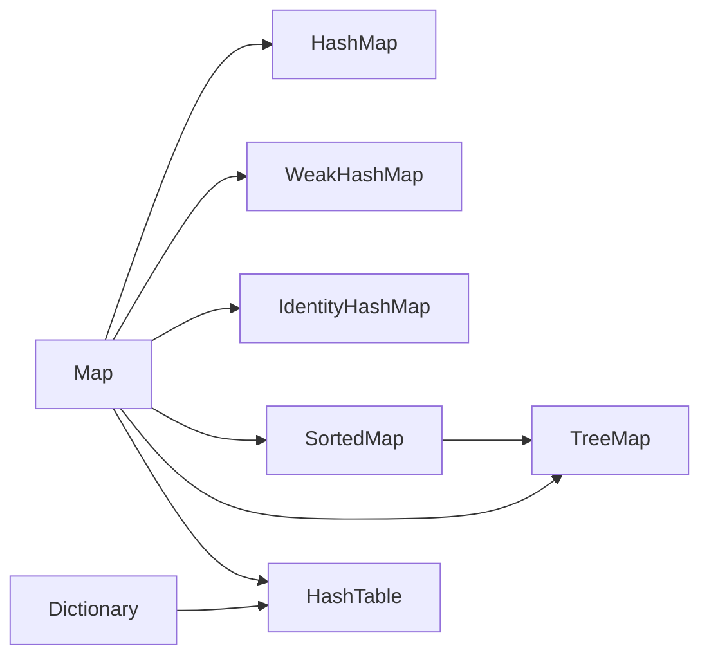

<font size="4">

# java数据结构

by 菲尼莫斯 2019年3月16日

---

## 堆、栈、池

> 栈(stack):是一个先进后出的数据结构，通常用于保存方法(函数)中的参数，局部变量。在java中，所有基本类型和引用类型都在栈中存储。栈中数据的生存空间一般在当前scopes内(就是由{...}括起来的区域)。

>堆(heap):是一个可动态申请的内存空间(其记录空闲内存空间的链表由操作系统维护)，C中的malloc语句所产生的内存空间就在堆中。 在java中，所有使用new xxx()构造出来的对象都在堆中存储，当垃圾回收器检测到某对象未被引用，则自动销毁该对象。所以，理论上说java中对象的生存空间是没有限制的，只要有引用类型指向它，则它就可以在任意地方被使用。

> 池(pool):是一组资源的集合，这组资源在服务器启动之初就完全被创建并初始化，这称为静态资源分配。当服务器进入正式运行阶段，即开始处理客户请求的时候，如果它需要相关的资源，就可以直接从池中获取，无需动态分配。直接从池中取得所需资源比动态分配资源的速度要快得多。当服务器处理完一个客户连接后，可以把相关的资源放回池中，无需执行系统调用来释放资源。从最终效果来看，池相当于服务器管理系统资源的应用设施，它避免了服务器对内核的频繁访问。

## 集合


### 集合常用方法

* 新版本java中推荐使用arrayList代替Vector集合，并可以使用同步线程包装器把arrayList变为线程安全的

* 查找
    * int size()
    * boolean isEmpty()
    * boolean contains(obj)：是否包含某个对象
    * boolean contains(collection)：是否包含某集合的所有元素

* 修改
    * boolean add(obj)
    * boolean addAll(collection)
    * boolean remove(obj)
    * boolean clear()：删除全部
    * boolean removeAll(collection)
    * boolean retainAll(collection)：保留参数集合中的所有内容，删除其他

* 其他
  * sort：需实现comparator接口
  * shuffle：打乱所有元素
  * reverse：反转
  * fill：把数组某一段填充为某一个值
  * copy：将目标集合复制覆盖到源集合的相应元素
  * min、max：需实现comparator接口

### 集合遍历

* Iterator 接口（enumeration已过时）
  * hasNext()
  * next()
  * remove()：去除最后调用next()的元素

### ArrayList

* 非线程安全

* 底层使用数组实现

* 适合查改，弱于增删

### LinkedList

* 非线程安全

* 实现了队列和堆栈的操作

* 适合增删，弱于查改

## Map

* 装填因子：填入的项数/表的容量，越高越容易发生冲突

* HashMap会自动根据容量和装填因子扩容

* HashMap的默认容量为10，装填因子为0.75

* list的默认容量是10？



### HashMap

* 非线程安全

* HashTable和HashMap的实现一致，但是是线程安全的且具备强一致性，但性能稍微降低
    * ConcurrentHashMap和HashTable一样是线程安全的，但HashTable的线程锁针对的是整个数组，ConcurrentHashMap是对内部结构中的部分数组进行线程锁，其他的部分依然可以同步操作，从而在线程安全的同时提高了效率

* 不保证映射顺序，且映射顺序可能会改变

* LinkedHashMap可以保证映射和元素迭代的顺序，但增加了时间和空间开销

* LinkedHashMap在HashMap的基础上维护了一个双向环形链表，该双向链表是插入键值的集合，记录了元素的插入顺序

* Hash碰撞会导致查询开销提高，扩容时的刷新开销也比较高

* 数据结构为**链表数组**
    * 通过hashcode找到数组中的某一元素（链表）
    * 通过key的equals方法在链表中找到key对应的value

```java

// 第一层数组
transient Entry[] table;
// 存储键值对的链表
static class Entry<K, V> implements Map.Entry<K, V> {
    final K Key;
    V value;
    // 指向链表的下一个元素
    Entry<K, V> next;
    final int hash;
    //....//
}
```

* 插入元素
    1. 判断插入的key是否为空
    2. 找到在链表数组的索引
    ```java
    // 根据keyCode重新计算hash值（该计算有多种实现方法，主要是要在防止冲突出现的同时，将原来的keycode变为和当前map大小相对应的数值）
    int hash = hash(key.hashCode());
    // 搜索该hash值应在在链表数组出现位置的索引
    int i = indexFor(hash, table.length);
    ```
    1. 通过索引获取对应链表，并遍历链表寻找key是否已存在
    ```java
    for (Entry<K, V> e = table[i]; e != null; e = e.next) {
        if (e.hash == hash && (e.key == key || key.equals(e.kek))) {
            //** 更新value并返回旧的值 **//
        }
    }
    ```
    1. 若key不存在则创建一个新的链表节点
    ```java
    void addEntry(int hash, K key, V value, int indexInTable) {
        // 当前数组位置的链表头
        Entry<K, V> e = table[indexInTable];
        // 将新的键值链表节点放在数组的该位置，充当头部
        table[indexInTable] = new Entry<K, V>(hash, key, value, e);
        // 若添加新的键值后超出map的装填因子，则把容量扩大一倍
        if (size ++ >= threshold) {
            // 该过程要重新计算位置并排列所有map中的数据，非常耗时
            resize(2 * table.length);
        }
    }
    ```
    * 如何通过hash值确定键值在链表数组的位置：
    ```java
    static int indexFor(int hash, int tableLength) {
        /**
         * 当tableLength = 2 ^ n 时，可以使数组的使用率最高
         * hash map的总容量为 2 ^ 2n，装填因子为默认0.75
         * 当size >= 0.75 * 2 ^ 2n 时就要扩容map
         * &运算比%运算要快
        */
        return hash & (tableLength - 1);
    }
    ```
### TreeMap

* 采用红黑树实现，自平衡二叉查找树

* 包含属性key、value、left、right、parent、color

* 通过key进行排序（比较大小）

* 具有较高的空间利用率，有稳定的操作性能O(log n)

* 适用于需要按照键进行排序的场合

### HashSet、TreeSet、LinkedHashSet

* 采用HashMap、TreeMap、LinkedHashMaped实现

* 主要对HashMap的key进行维护，因此使用虚拟Object作为Value

</font>
