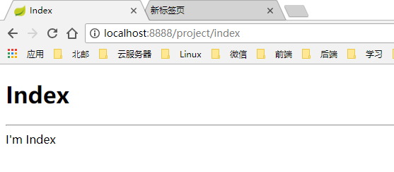
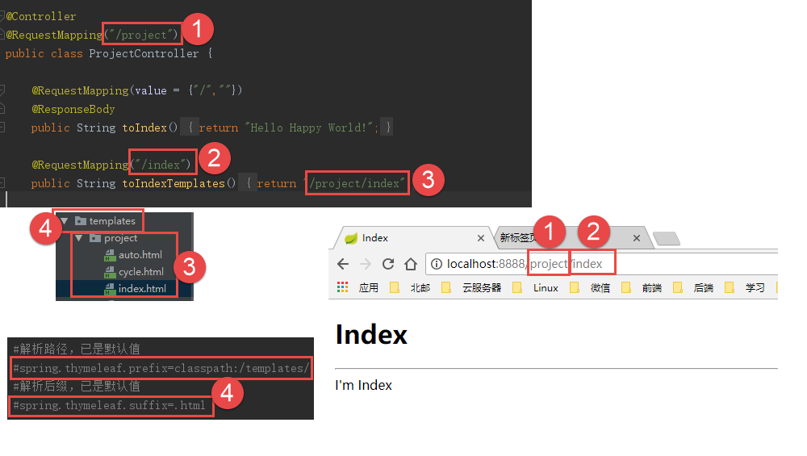
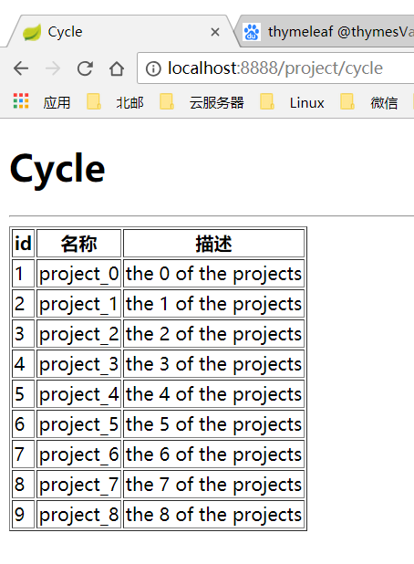
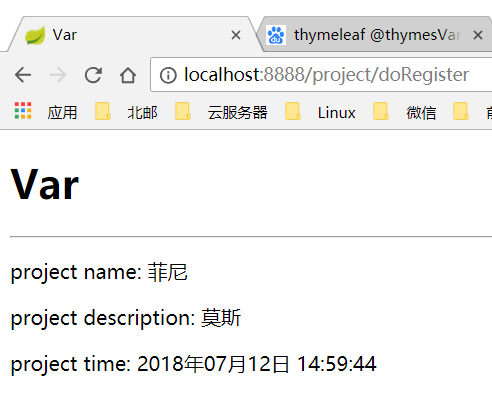

<font size="4">
# 动态页面

by 菲尼莫斯 2018年7月12日
---
## 实用技巧

当我们配置过spring boot的热部署后

我们在保持服务器运行的状态下，在修改过的页面实用ctrl+shift+F9即可完成热部署。

我们直接刷新页面即可看到修改过的效果，而不用重启服务器


## 配置动态页面的参数
thymeleaf是一种动态页面模板。

spring boot官方不推荐使用jsp来进行动态页面编写，推荐使用thymeleaf代替。

在application.properties中加入thymeleaf的相关配置：

```yml
##
#   thymeleaf配置
##
#设置动态页面的编码格式
spring.thymeleaf.encoding=utf-8
#关闭thymeleaf缓存，从而实时刷新页面热部署
spring.thymeleaf.cache=false
#模板文件的解析路径，当前已是默认值
#spring.thymeleaf.prefix=classpath:/templates/
#模板文件的解析后缀，当前已是默认值
#spring.thymeleaf.suffix=.html
```
我们可以看到thymeleaf的模板文件需存放在resources/templates文件夹下，且需要命名为xxx.html。

## 创建目录结构

创建一个controller包和一个pojo包

模板templates文件夹下新建project和user文件夹


## 初见controller

在controller包下新建一个ProjectController类


在ProjectController加入如下代码


**@controller：** 标签表示这个类是一个controller，有了它，这个类能够被spring boot自动识别，controller是控制跳转、控制动态页面内容，以及用户端和服务器段进行数据交互的基础。

controller类中的方法便是服务器提供的http交互的接口

**@RequestMapping：** 表示一个http接口的url地址
* 如果写在类上，则表示该controller中所有http接口的url都需要附上该前缀。
* 写在方法上，则表示该接口独立的url地址

**@ResponseBody：** 表示该接口返回的是一串数据，具体效果后面展示

>光看文字解释，你一定有很多的疑问，但没关系，我们先看一看它的效果

##效果演示

保存，并运行我们的spring boot


可以看到浏览器中直接出现了我们方法中return的值

> 之前的一系列疑惑我们先带着，继续探究controller

## 进一步探究controller

从刚刚的效果来看，我们仅仅从服务器获取了一句话，说到底我们该如何才能用controller访问一个模板页面呢？

首先我们肯定要新建一个模板页面，还记得之前配置的thymeleaf路径吗？

我们在templates/project文件夹下新建一个index.html：

```html
<!DOCTYPE html>
<html lang="en" xmlns:th="http://www.thymeleaf.org">
<head>
    <meta charset="UTF-8">
    <title>Index</title>
</head>
<body>
<h1>Index</h1>
<hr>
I'm Index

</body>
</html>
```
一定要加上这句话：xmlns:th="http://www.thymeleaf.org"

它表示我们的.html页面是一个thymeleaf模板

紧接着我们为这个页面配置一个url

在ProjectController中添加一个接口：

```Java
@RequestMapping("/index")
@ResponseBody
public String toIndexTemplates(){
    return "/project/index";
}
```

重启spring boot查看效果：


我们发现，服务器居然把模板页面的路径返回来了

别着急，还记得我们之前说过 **@ResponseBody：** 表示该接口返回的是一串数据吗？

我们去掉@ResponseBody再试一次



成功了

## controller小节

相信到这里，你已经能看出controller的基本套路了

我们来总结一下@RequestMapping吧

相同的数字标签间有着一一对应的关系：



## 初见动态页面

首先在ProjectController中新建一个接口：

```Java
@RequestMapping("/normal")
public String toNormal(Model model){
    model.addAttribute("name","Hello Happy World");
    model.addAttribute("description","Happy! Lucky! Simile! Yeah!");
    return "/project/normal";
}
```

我可以看到，接口中引入了一个model对象

所谓动态页面，就是我们可以随心所欲的将我们需要的数据填充到页面模板中

model对象的作用就是为我们的页面执行传递数据的功能

demo中，我们将创建了两个 **Attribute**（可理解为变量）： **name** 和 **description**，并为他们进行了赋值，并转到了"/project/normal"这个页面

我们在templates/project下新建一个模板页面normal：

```html
<!DOCTYPE html>
<html lang="en" xmlns:th="http://www.thymeleaf.org">
<head>
    <meta charset="UTF-8">
    <title>Normal</title>
</head>
<body>
<h1>Normal</h1>
<hr>
<p>project name:
    <!--/*@thymesVar id="name" type="java.lang.String"*/-->
    <span th:text="${name}"></span></p>
<p>project description:
    <!--/*@thymesVar id="description" type="java.lang.String"*/-->
    <span th:text="${description}"></span>
</p>

</body>
</html>
```

在thymeleaf中使用 **th:text** 属性可以动态改变一个html元素内的内容

demo中，我们将span标签的值动态改变成了我们传递过来的两个Attribute

**注** ：变量和表达式一定要用${}包裹起来，若不进行包裹，会直接解析为字符串。

重启服务器，查看一下运行结果：


可以看到，我们成功将controller中的值传递到了动态模板中

## Javabean与动态路由的操作

百度中对Javabean的解释十分的专业，不易理解，我们来实际创建一个

我们在pojo包下新建一个java bean命名为Project：

```Java
public class Project {
    private String name;
    private String description;
    private Date time;

    public String getName() {return name;}
    public void setName(String name) {this.name = name;}

    public String getDescription() {return description;}
    public void setDescription(String description) {this.description = description;}

    public Date getTime() {return time;}
    public void setTime(Date time) {this.time = time;}
}

```
可以看到Javabean包含一系列private属性，且每一个属性都有一对public的 **getXXX** 和 **setXXX** 方法对其进行取值和赋值

> 属性名xxx小写，get和set后接大写字母开头的属性名，是很重要的命名规则，不要随意改变

记住这些就足够了，这便是一个最基础的Javabean

接下来我们来看一下如何使用Javabean

我们在ProjectController中新建一个接口：

```Java
@RequestMapping("/{name}")
public String toAuto(Model model, @PathVariable String name){
    Project project = new Project();
    project.setName(name);
    project.setTime(new Date());
    model.addAttribute("project",project);
    return "/project/auto";
}
```

这里我们用到了动态路由@RequestMapping("/{name}")

被{}包裹的部分即为动态部分，其中值表示动态变量名称

我们用@PathVariable String name来获取该变量

接口中：
* 新建了一个Javabean
* 把我们的动态路由中的值赋值给了Javabean的name属性
* 我们获取了当前的时间，并把它赋值给了Javabean的time属性
* 我们直接将Javabean赋给了一个名为project的Attribute对象
* 返回"/project/auto"的动态模板

我们在templates/project下新建一个auto模板页面：
```html
<!DOCTYPE html>
<html lang="en" xmlns:th="http://www.thymeleaf.org">
<head>
    <meta charset="UTF-8">
    <title>Auto</title>
</head>
<body>
<h1>Auto</h1>
<hr>
<p>project name:

    <!--/*@thymesVar id="project" type="com.bupt317.study.demo_boot.pojo.Project"*/-->
    <span th:text="${project.name}"></span></p>
<p>project time:
    <!--/*@thymesVar id="project" type="com.bupt317.study.demo_boot.pojo.Project"*/-->
    <span th:text="${#dates.format(project.time,'yyyy年MM月dd日 HH:mm:ss')}"></span>
</p>

</body>
</html>
```
我们传入的Attribute是一个名为project的Javabean对象

可以看到我们直接使用project.name的形式即可直接调用Javabean中的属性了，原因就是我们的Javabean有getName方法，thymeleaf会自动根据属性名调用该方法。

接下来我们用thymeleaf中的自带函数dates.format(date,fmt)来将我们的日期进行格式化：

* 要调用thymeleaf的函数首先要用${}包裹起来，然后在函数名前加#即可
* 该函数的第一个输入参数是一个Date对象，正好我们Javabean中的time属性就是一个Date对象
* 第二个输入参数是格式化字符串，函数会自动以时间替换字符串中的yyyy(年),MM（月）,dd（日）,HH（小时）,mm（分）和ss（秒）部分


接下来我们重启服务器来看一下效果


可以看到我们输入的url将会被自动赋值到name，这就是动态路由的效果


## url传值

如果要传递多个参数的话，光靠动态路由是不行的

这时我们就需要用到url传值，也就是传说中的http get

我们在ProjectController中新建一个接口：

```Java
@RequestMapping("/var")
public String toVar(Model model,String name,String description){
    Project project = new Project();
    project.setName(name);
    project.setDescription(description);
    project.setTime(new Date());
    model.addAttribute("project",project);
    return "/project/var";
}
```

在demo中我们传入了name和description两个参数，并将它们的值赋给了新建Javabean中的对应属性，最后我们把Javabean返回给了"/project/var"这个动态页面

之后在templates/project文件夹下新建var页面

```html
<!DOCTYPE html>
<html lang="en" xmlns:th="http://www.thymeleaf.org">
<head>
    <meta charset="UTF-8">
    <title>Var</title>
</head>
<body>
<h1>Var</h1>
<hr>
<p>project name:
    <!--/*@thymesVar id="project" type="com.bupt317.study.demo_boot.pojo.Project"*/-->
    <span th:text="${project.name}"></span></p>
<p>project description:
    <!--/*@thymesVar id="project" type="com.bupt317.study.demo_boot.pojo.Project"*/-->
    <span th:text="${project.description}"></span></p>
<p>project time:
    <!--/*@thymesVar id="project" type="com.bupt317.study.demo_boot.pojo.Project"*/-->
    <span th:text="${#dates.format(project.time,'yyyy年MM月dd日 HH:mm:ss')}"></span>
</p>
</body>
</html>
```

重启服务器，并在url中传入我们的参数，查看页面效果：


该方法和http get传值的方法相同，我们需要注意以下对应关系：

* 传值要和前面的url地址间用？隔开，多个值之间用&隔开
* 传值变量名称和controller接口的形参相对应：


## 动态模板的循环显示

如果我们有一串数据要显示时，我们不可能一一去输入，这时我们就需要用到循环显示

添加一个接口：

```Java
@RequestMapping("/cycle")
public String toCycle(Model model){
    List<Project> list = new ArrayList<>();
    for (int i = 0; i < 9; i++) {
        Project project = new Project();
        project.setName("project_"+i);
        project.setDescription("the "+i+" of the projects");
        list.add(project);
    }
    model.addAttribute("list",list);
    return "/project/cycle";
}
```
我们模拟生成了10个project对象保存到了一个arrayList里面，并将它作为一个名为list的Attribute放入model中。

新建一个cycle模板：
```html
<!DOCTYPE html>
<html lang="en" xmlns:th="http://www.thymeleaf.org">
<head>
    <meta charset="UTF-8">
    <title>Cycle</title>
</head>
<body>
<h1>Cycle</h1>
<hr>
<table border="1">
    <thead>
    <tr>
        <th>id</th>
        <th>名称</th>
        <th>描述</th>
    </tr>
    </thead>

    <tbody>
    <tr th:each="project,stat:${list}">
        <td th:text="${stat.count}"></td>
        <td th:text="${project.name}"></td>
        <td th:text="${project.description}"></td>
    </tr>
    </tbody>
</table>

</body>
</html>
```

模板中，我们放入了一个table，并将list中的project循环显示到table中。

* th:each表示遍历，基本形式为：th:each=“子对象变量名称,状态变量名称:父对象”
* 子对象变量和状态变量都可任意命名，这里我们以project作为子对象名，stat作为状态变量名
* stat状态变量中保存有本次遍历的基本信息，其中最常用的有count属性，表示当前循环的次数

重启服务器，我们可以看到以下效果



可以看到
```html
<tr th:each="project,stat:${list}">
    <td th:text="${stat.count}"></td>
    <td th:text="${project.name}"></td>
    <td th:text="${project.description}"></td>
</tr>
```
变成了：
```html
<tr>
   <td>1</td>
   <td>project_0</td>
   <td>the 0 of the projects</td>
</tr>
<tr>
   <td>2</td>
   <td>project_1</td>
   <td>the 1 of the projects</td>
</tr>
<tr>
   <td>3</td>
   <td>project_2</td>
   <td>the 2 of the projects</td>
</tr>
。。。。。。

```

## 表单的提交

经常看到网页上的用于提交的输入框是如何工作的呢？

首先我们在resources/static下面创建一个静态页面projectRegister.html，里面放入一个表单：

```html
<!DOCTYPE html>
<html lang="en">
<head>
    <meta charset="UTF-8">
    <title>Project Register</title>
</head>
<body>
<h1>Project Register</h1>
<hr>
<form action="project/doRegister" method="post">
    <p>Name:
        <label>
            <input type="text" name="name">
        </label>
    </p>
    <p>Description:
        <label>
            <input type="text" name="description">
        </label>
    </p>
    <input type="submit" value="提交">
</form>
</body>
</html>
```

其中form既是表单的主体：

* action属性指向了表单的提交地址
* method表示表单的提交方式，常用的有get和post两种
* \<input type="submit"\>是无JavaScript触发表单提交的位置
* 提交后会将form下的所有带有name和value属性的元素发送到action地址
* 页面中我们提供了两个填写位置，指定其name属性为“name”和“description”

我们根据表单提交的地址，在ProjectController中建立一个接口：

```Java
@RequestMapping(value = {"/doRegister"},method = RequestMethod.POST)
public String doRegister(Model model,Project project){
    project.setTime(new Date());
    model.addAttribute("project",project);
    return "/project/var";
}
```

这里我们直接使用了Javabean Project作为接收对象，原因是Javabean中包含有name和description的同名属性，spring boot可以自动将表单传递过来的这两个属性识别并赋值到我们的Javabean。其对应关系如下：


重启服务器，查看效果：




如果我们把form表单的method从post换成get会有什么效果：


* 我们可以看到页面跳转到了我们的动态路由页面
* 由于我们在controller中指定了doRegister接口的传递方式为post，因此如果我们用get提交，就会被自动解析为我们之前的动态路由
* 可以看到用get方式提交from，会自动把我们填写的值写到url参数中，可见get和url传参其实本质上是一样的

</font>
