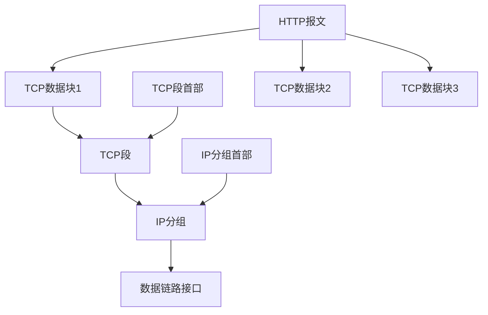

# http连接

by 菲尼莫斯 2019年3月18日

---

## TCP

* TCP是可靠的比特传输管道：从一端填入的字节可以从另一端有序、正确地得到

* http报文数据以流的形式进入TCP管道

* TCP将收到的数据流分为小的TCP段

* TCP将TCP段封装到IP分组中

* IP分组直接通过数据链路接口传播

* https则是将通过TCP传送的数据先进行TSL/SSL加密

* 源端口指的是TCP连接的对方要发送数据包时到达的本地的实际端口

* 目的端口指的是TCP连接的对方接收己方数据包时所用的端口

* TCP/IP连接要求**源IP地址、源端口、目的IP地址、目的端口**四者不完全相同，但一般情况下对于客户端来说目的IP地址和目的端口是不变的，因此若要建立多条连接，则需要使用不同的端口或虚拟IP来访问服务端（浏览器会自动重用和新开端口）

### 特性

* TCP是网络层协议，保证数据传输的有序、正确和可靠

* IP是传输层协议，负责寻址将数据发送到目的地

* 每个TCP段都有序列号和完整性校验和

* 每个TCP段的接收者收到TCP段后都必须向发送者回复确认信息，该确认信息可以捎带在数据分组中

* 若发送者在指定窗口时间内没收到确认信息，便默认分组损坏并重新发送

### 性能问题

* TCP慢启动：每成功接收一个分组，发送端才有发送另外两个分组的权限（即刚启动只能发一个分组，然后依次翻倍1 -> 2 -> 4 -> 8）

* 延迟确认算法：由于确认信息的数据量很小，所以确认信息会先等待一定时间，若期间有别的数据要发送，则确认信息会随该数据分组一同发送，否则才单独发送确认分组

* TCP_NODELAY：由于每个TCP段都包含40字节的标记和首部，因此鼓励一次发送最大量的数据以保证效率
    * nagle算法的规则是当其他所有TCP分组都被确认之后才能发送不全尺寸的分组
    * nagle算法可以在**上一个TCP分组等待确认时**，将接下来要发送的数据缓存起来，**累计到全尺寸**或者**上一个分组被确认时**，才发送下一个分组。
    * 1.nagle和延迟确认算法间存在冲突；2.对于小的报文会存在一个“白等”的缓存时间
    * nagle算法可以通过TCP_NODELAY中关闭

* TIME_WAIT：在关闭TCP连接后，会维护一个缓存（2倍MSL（最大分段试用期，即TCP分组在因特网队列中最长保留时间））记录所关闭连接的IP地址和端口，确保不会创建新的相同的连接。对于服务端来说，若每次连接服务端都要建立一条新的TCP连接的话，就必须使用不同的端口或IP地址（服务端的IP和端口不变），因此在2MSL内请求过多次数的话有可能导致端口TIME_WAIT耗尽问题

### 其他

* TCP连接可能会在任何情况下关闭（一般情况下都会在一条报文结束后关闭），此时Content-Length首部显得尤为重要

* 非正常关闭己方连接（如在确认对方收到响应后，单方面关闭连接）会造成对方误认为响应错误，而丢弃之前收到的数据

* 正确的关闭方式应为：双方发送关闭连接请求后，关闭各自的输出后，等待对方连接关闭的请求或超时后自行关闭连接

## http

### 首部

* connection：列出了当前http报文中的转发方（如代理和缓存等）不应该转发，而应在转发之前删除的http首部名称，若为close则表示发送完下一条报文后应该关闭连接

### http性能问题

* 串行地建立TCP连接：效率最低，延迟最高

* 并行地建立TCP连接：同时加载资源的不同部分，比起串行连接（连接越多速度不一定总是更快，因此浏览器将连接限定在4个左右，服务端也可以随意关闭重用的连接）

* 持久化TCP连接：多条事物串行重用一条TCP连接，消除连接建立的时延，确保使用少的连接做更多的事，且可以**避免TCP的慢启动**
    * http/1.0使用Connection：Keep-Alive进行连接持久化，默认是不进行持久化的
    * http/1.1默认开启persistent持久化连接，并用connection：close进行关闭,（存疑：一个客户端和任何服务器之间只能委会两条持久连接）

* 管道化TCP连接：通过共享的TCP连接发起并发的HTTP请求
    * 即在**同一条持久化TCP连接**上，客户端的一条http请求发送完，**在服务器收到并确认和回应前**，紧接着发送另一条http请求；
    * 需要注意的是，由于网络中时延的不确定性，http请求最好是无序的，服务端会按照收到的顺序会送http响应
    * 客户端要做好tcp连接会随时关闭的准备，服务器可能在接收前半组的http请求后就关闭tcp连接。
    * 在出错时客户端无法获知服务器执行了一系列请求中的哪一些，无法适应非幂等的请求（幂等：任意多次执行请求对资源本身所产生的影响均与一次执行的影响相同，post请求是非幂等的，因此无法安全地重试）

* 复用连接：交替传送请求和响应报文

### http请求过程

1. 解析主机名
2. 解析IP地址
3. 解析端口号
4. 建立TCP连接
5. 发送请求报文
6. 接收响应报文
7. 关闭连接

