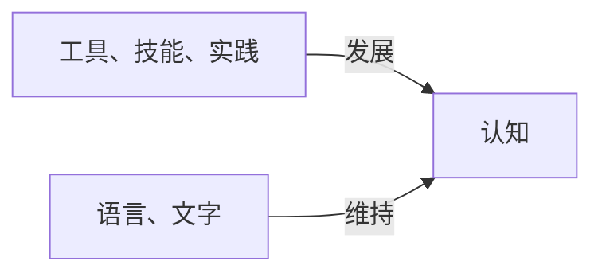

# 序章

**生物的演化**

---

**思维的由来**

---

**认知的发展**

---

**加速回报定律**

生物、科技等的演化产物其复杂性和能力呈指数级增长

加速回报定律揭示了不可能有其他智能物种（至少地球？）

> 技术的进化不是线性的，而是指数级增长的。这意味着技术改良的速度会越来越快，并且每一轮新的进步都会以前一轮的进步为基础，从而导致革新步伐的不断加快。

> 随着时间的推移，信息科技的发展速度将会持续加速，而这种加速不仅影响到计算机和互联网等数字领域，也会影响到生物技术、纳米技术和其它依赖于信息技术的领域。

> 加速回报定律的核心概念在于，随着技术变得更为先进，它能够更有效地帮助我们开发出下一代技术，进而形成一个正反馈循环。例如，在计算机科学中，摩尔定律描述了芯片上可容纳的晶体管数目大约每两年就会翻一番，这直接导致计算能力的快速提升，而更快的计算能力又进一步促进了更多领域的创新和发展。

---

**工程学** 能够放大自然现象，无论该现象是否目前科学可解释（如飞机的升力）

---

**思维模式识别理论** 描述了人脑的基本算法

加速汇报定律 + 思维模式识别理论 + 工程学 = 人工智能

---

人工智能基于"统计分析"的回答方式，本质上与人类生物学的思考方式在数学上十分相似，人工智能无法理解的东西，人类也无法理解

---

人脑类似于 **曼德布洛特集** 既复杂又不复杂

> 曼德布洛特集（Mandelbrot set）定义为：对于每一个复数 $z$ (即$a+bi$)和常数$c$，考虑以下的二次多项式映射：  
> $f(z)=z^2+c$  
> 从 $z=0$ 开始，重复应用这个映射，即计算 $f(0)$, $f(f(0))$, $f(f(f(0)))$,... 等等。如果这个序列的绝对值不会趋向于无穷大，那么我们说c属于曼德布洛特集；否则不属于该集合。

> 具体来说，如果对于某个c，上述序列中的任意一项的模长超过了2，我们可以断定这个序列将趋向无穷大，因此c不属于曼德布洛特集。这是因为如果序列中某项的模长大于2，则之后各项的模长将会持续增大。

> 曼德布洛特集的一个显著特点是它的边界是无限复杂的。无论你如何放大它的边界，都会发现新的细节和结构，这体现了分形的本质特性——自相似性。这意味着部分与整体在某种意义上是相似的，尽管不是完全相同。

> 分形（Fractal）是数学中的一种几何形状，其特点是具有不规则的、破碎的形态，并且这种形态在不同尺度下都表现出相似的复杂性。

> 自相似性是指一个对象的某一部分与整个对象本身非常相似，甚至完全相同。这意味着如果你放大分形的一部分，它看起来会和原来的图形或者另一部分有相似的结构。这种特性可以在自然界中找到很多例子，比如雪花的晶体结构、海岸线的轮廓、树木的分支、河流网络等。

