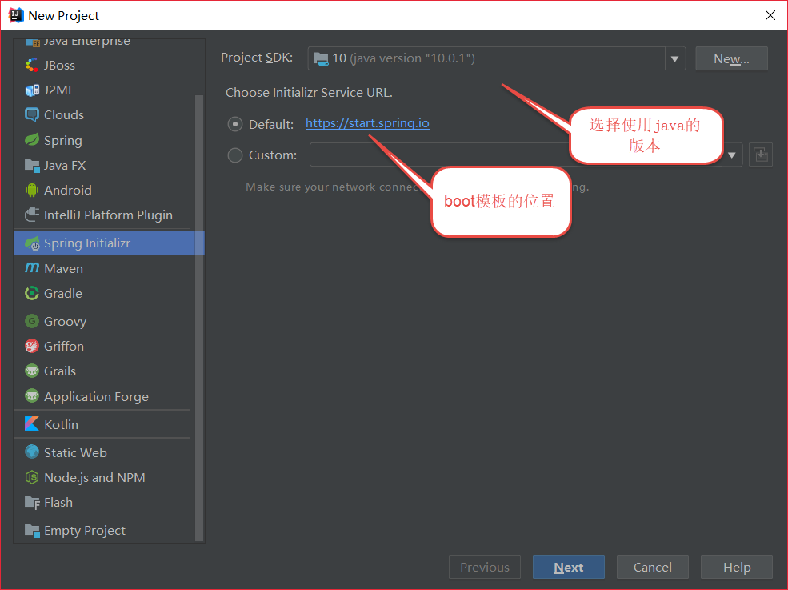
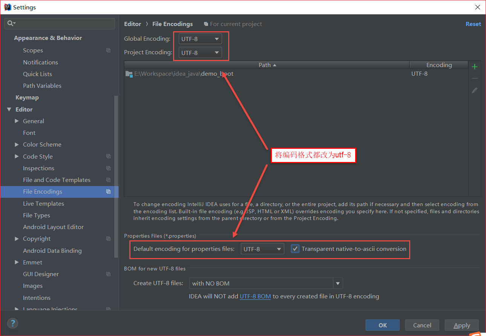
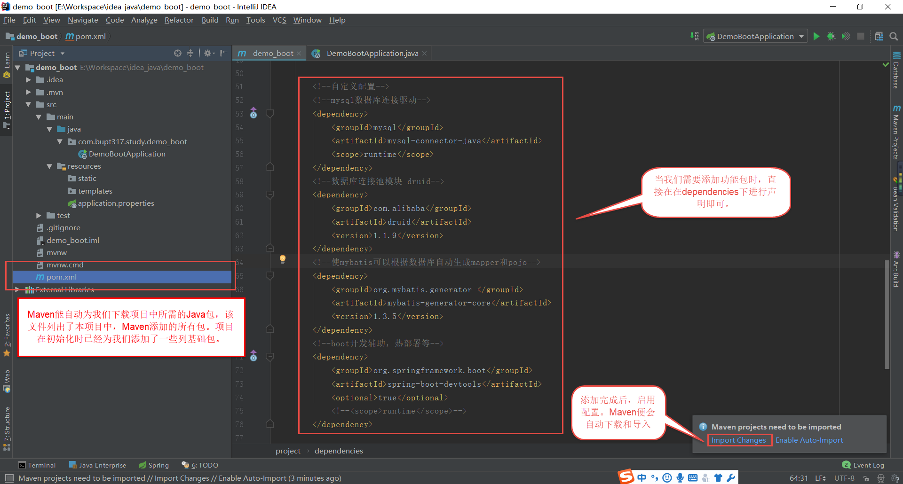

<font size="4">

# 创建项目

---
## 代码风格

* **类名、组件和常量** 以大驼峰式命名：如UserManager、ArticleTitleIndex
* **变量** 以小驼峰式命名：如userManger、articleTitleIndex
* **资源文件、配置文件、文件夹** 以小写英文单词加"-"命名: 如user-manger、article-title-index
* 模块化编程，**将系统功能抽取出来建立多个文件（模块），通过引用的方式进行连接**，一个文件的代码尽量控制在300行以内
* 多运用文件夹和包将代码或资源归类

## 将Maven配置于IDEA

## 创建一个spring boot项目



**项目的目录如上图所示**
* **java** 是我们编写和存放java代码的目录
* **xxxApplication** 是spring boot程序的入口，里面包含了一个main函数，该文件的位置比较重要，不要随意改变
* **resources** 是存放资源文件的目录
* **static** 存放的静态资源可以直接访问
* **templates** 存放动态模板资源，需要用controller跳转
* **application.properties** 是spring boot的全局配置文件，该文件的位置比较重要，不要随意改变
* **pom.xml** 是Maven的核心文件


## 定制我们的项目
### 统一编码格式

### pom.xml文件说明

我们为pom文件中添加如下包试试，添加完毕后记得import change
```xml
<!--自定义配置-->
<!--boot开发辅助，热部署等-->
<dependency>
    <groupId>org.springframework.boot</groupId>
    <artifactId>spring-boot-devtools</artifactId>
    <optional>true</optional>
    <!--<scope>runtime</scope>-->
</dependency>
```


添加完毕后记得import change
```xml
<configuration>
    <!--开启热部署-->
    <fork>true</fork>
    <!-- spring-boot:run 中文乱码解决 -->
    <jvmArguments>-Dfile.encoding=UTF-8</jvmArguments>
</configuration>
```
### 配置服务器
application.properties中可以进行spring boot的全局配置，也就是写在此处的配置必然能够生效
我们在其中加入如下配置：
```yml
##
#   服务器配置
##
#服务器访问的端口号，自定义即可
server.port=8888
#服务器访问的根url
server.servlet.context-path=/
```
## 测试一下

至此，一个纯显示功能的spring boot框架就搭建完成了，快来测试一下吧。

### 在static编写两个测试页面


**index.xml:**
```html
<!DOCTYPE html>
<html lang="en">
<head>
    <meta charset="UTF-8">
    <title>index</title>
</head>
<body>
<h1>Hello World</h1>
<hr>
<a href="project.html">页面跳转</a>

</body>
</html>
```

**project.xml:**
```html
<!DOCTYPE html>
<html lang="en">
<head>
    <meta charset="UTF-8">
    <title>project</title>
</head>
<body>
<h1>项目详情</h1>
项目名称：demo_boot
项目简介：一个spring boot 学习项目

</body>
</html>
```

### 将pom文件中数据库相关的包注释

由于现阶段还未连接数据库，所以mybatis会报错，我们将它注释了：


### 启动服务器


### 查看效果


点击页面跳转查看效果


</font>
