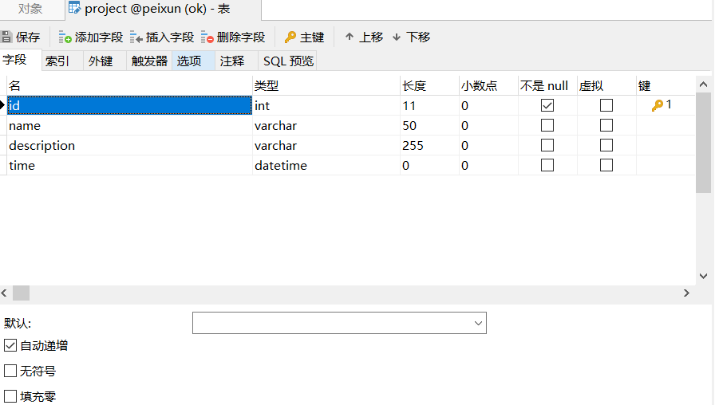
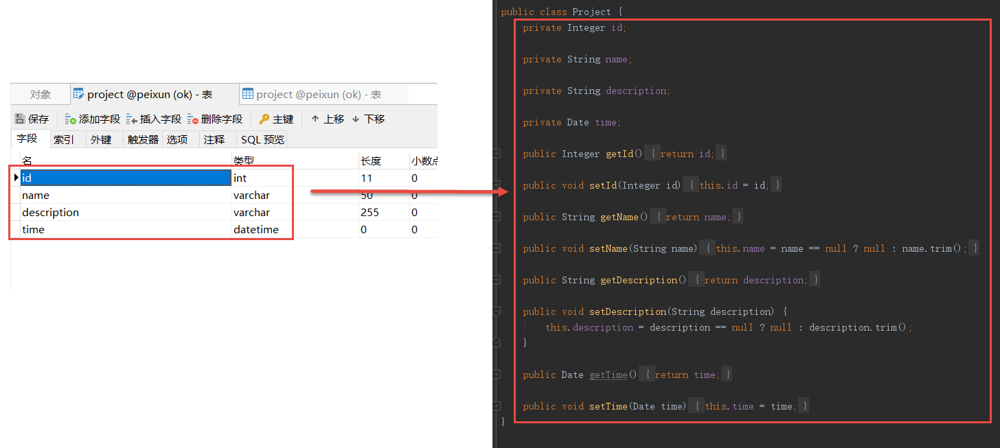
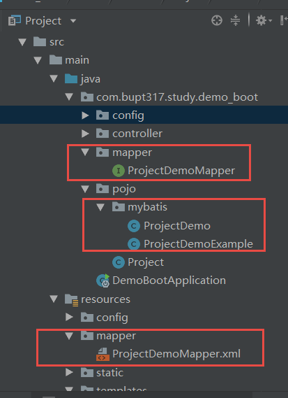
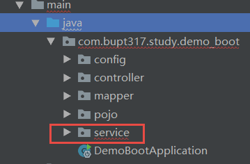
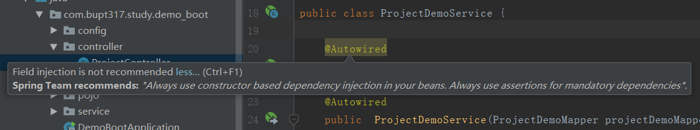
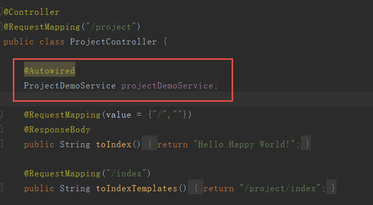
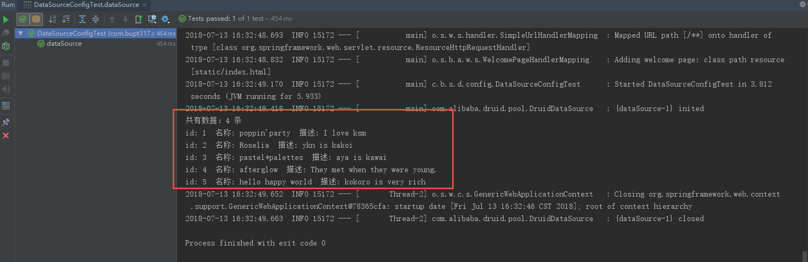
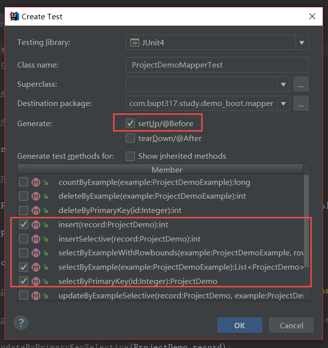

<font size="4">

# 数据库连接

by 菲尼莫斯 2018年7月13日

---

## 数据库准备

使用Navicat连接到本地mysql数据库

**新建连接：**


**新建一个数据库：**

名字随便取，字符集选择utf8，排序规则不填默认即可

**新建一个表名为project_demo：我们设置id自动递增，为该表的主键**



**在表里随便插入几条数据：**


## 数据库驱动和配置

要在java里连接数据库，有两个因素是必不可少的，一是MySQL官方提供的java驱动，二是各家公司进行数据存取优化后生成的DataSource连接池。

**在pom文件中引入驱动和连接池：**

```xml
<!--mysql连接驱动-->
<dependency>
    <groupId>mysql</groupId>
    <artifactId>mysql-connector-java</artifactId>
    <scope>runtime</scope>
</dependency>
<!--datasource连接池 druid-->
<dependency>
    <groupId>com.alibaba</groupId>
    <artifactId>druid</artifactId>
    <version>1.1.9</version>
</dependency>
```

这样我们就达成了连接数据库的第一步

接下来要做的就是配置数据库的地址、用户名和密码了

我们在resources文件夹下新建config文件夹，在其中新建一个配置文件db.properties

```yml
##
#  数据库配置
##
db.url=jdbc:mysql://localhost/xxxx?useSSL=false
db.username=root
db.password=xxxx
db.driverClassName=com.mysql.jdbc.Driver
```
db.url的xxxx部分填写刚刚新建数据库所取的数据库名

username用户名，password密码，填写安装mysql时所设置的

## 生成连接池

接着我们把这些参数配置到数据池，并注入spring boot

新建config和mapper两个包：


config包下新建DataSourceConfig类：

```JAVA
//@Configuration注解告诉spring boot这是一个配置类，启动时会自动扫描其下的@bean注解，并加入spring boot容器进行自动管理
@Configuration
//@PropertySource解引入了刚刚我们创建数据库参数配置文件，注意classpath可以直接指向我们的资源文件夹即resources文件夹
@PropertySource("classpath:config/db.properties")
public class DataSourceConfig {

    //@Value注解可以从引入的properties文件中将对应属性值赋给注解下面的变量
    @Value("${db.url}")
    private String url;
    @Value("${db.username}")
    private String username;
    @Value("${db.password}")
    private String password;
    @Value("${db.driverClassName}")
    private String driverClassName;

    //@Bean注解标示了该方法返回值的对象将被spring boot所托管
    //这里我们在方法中新建了一个连接池，并对其进行配置，最终返回了一个连接池对象
    @Bean
    //@Primary注解表示该Bean对象会覆盖掉spring所托管的其他同名对象
    @Primary
    public DataSource dataSource(){
        //新建一个连接池对象
        DruidDataSource dataSource = new DruidDataSource();
        //设置各项参数
        dataSource.setUrl(url);
        dataSource.setUsername(username);
        dataSource.setPassword(password);
        dataSource.setDriverClassName(driverClassName);
        //返回给spring boot 容器
        return dataSource;
    }
}
```

如此一来，我们就能连接到mysql数据库了


## mybatis配置

如果你有过jdbc基础的话，你一定会觉得传统的直接调用DataSource来进行数据库sql操作非常的麻烦且容易出错

因此我们引出了专门进行数据库操作的框架mybatis

还记得首次创建spring boot 项目时我们在pom文件中注释了mybatis相关内容吗，现在我们将它恢复过来就可以了：

```xml
<dependency>
    <groupId>org.mybatis.spring.boot</groupId>
    <artifactId>mybatis-spring-boot-starter</artifactId>
    <version>1.3.2</version>
</dependency>
```

## mybatis逆向工程配置

我们再在pom文件中添加一套mybatis逆向工程插件：它的作用是可以根据mysql数据库中的表格自动生成一套增删改查接口，就不用像之前这么麻烦地进行数据库操作了。

```xml
<!--mybatis逆向工程插件-->
<plugin>
    <groupId>org.mybatis.generator </groupId>
    <artifactId>mybatis-generator-maven-plugin</artifactId>
    <version>1.3.5</version>
    <configuration>
        <!--允许移动生成的文件 -->
        <verbose>true</verbose>
        <!-- 是否覆盖 -->
        <overwrite>true</overwrite>
        <!--配置文件位置-->
        <configurationFile> src/main/resources/config/mybatisGeneratorConfig.xml</configurationFile>
    </configuration>
    <dependencies>
        <dependency>
            <groupId>mysql</groupId>
            <artifactId>mysql-connector-java</artifactId>
            <version>5.1.30</version>
        </dependency>
    </dependencies>
</plugin>
```
我们发现逆向工程需要有一个配置文件
```xml
<configurationFile> src/main/resources/config/mybatisGeneratorConfig.xml</configurationFile>
```
我们就在该位置新建一个配置文件mybatisGeneratorConfig.xml：


```xml
<?xml version="1.0" encoding="UTF-8"?>
<!DOCTYPE generatorConfiguration
        PUBLIC "-//mybatis.org//DTD MyBatis Generator Configuration 1.0//EN"
        "http://mybatis.org/dtd/mybatis-generator-config_1_0.dtd">

<!--该文件用于配置mybatis的自动生成-->
<generatorConfiguration>
    <context id="testTables" targetRuntime="MyBatis3">
        <!-- 开启分页查询 -->
        <plugin type="org.mybatis.generator.plugins.RowBoundsPlugin">
        </plugin>
        <commentGenerator>
            <!-- 是否去除自动生成的注释 true：是 ： false:否 -->
            <property name="suppressAllComments" value="true"/>
        </commentGenerator>


        <!--
          _
          -关键！ 数据库的配置参数
          _
         -->
        <!--数据库连接的信息：驱动类、连接地址、用户名、密码 -->
        <jdbcConnection driverClass="com.mysql.jdbc.Driver"
                        connectionURL="jdbc:mysql://localhost/xxxx?useSSL=false"
                        userId="root"
                        password="xxxx">
        </jdbcConnection>


        <!-- 默认false，把JDBC DECIMAL 和 NUMERIC 类型解析为 Integer，为 true时把JDBC DECIMAL 和
            NUMERIC 类型解析为java.math.BigDecimal -->
        <javaTypeResolver>
            <property name="forceBigDecimals" value="false"/>
        </javaTypeResolver>


        <!--
          _
          -关键！javabean的生成位置
          _
         -->
        <!-- targetProject:生成PO类的位置 -->
        <javaModelGenerator targetPackage="com.bupt317.study.demo_boot.pojo.mybatis"
                            targetProject="./src/main/java">


            <!-- enableSubPackages:是否让schema作为包的后缀 -->
            <property name="enableSubPackages" value="false"/>
            <!-- 从数据库返回的值被清理前后的空格 -->
            <property name="trimStrings" value="true"/>
        </javaModelGenerator>

        <!--
          _
          -关键！ mapper.xml的生成位置
          _
         -->
        <!-- targetProject:mapper映射文件生成的位置 -->
        <!--注意：此处targetProject生成位置为resource下-->
        <sqlMapGenerator targetPackage="mapper"
                         targetProject="./src/main/resources/">


            <!-- enableSubPackages:是否让schema作为包的后缀 -->
            <property name="enableSubPackages" value="false"/>
        </sqlMapGenerator>


        <!--
          _
          -关键！ mapper.java的生成位置
          _
         -->
        <!-- targetPackage：mapper接口生成的位置 -->
        <javaClientGenerator type="XMLMAPPER"
                             targetPackage="com.bupt317.study.demo_boot.mapper"
                             targetProject="./src/main/java">
            <!-- enableSubPackages:是否让schema作为包的后缀 -->
            <property name="enableSubPackages" value="false"/>
        </javaClientGenerator>


        <!--
          _
          -关键！ 指定数据库中的指定表
          _
         -->
        <!-- 指定数据库表 -->
        <table tableName="project">
        </table>

        <!-- 有些表的字段需要指定java类型
         <table schema="" tableName="">
            <columnOverride column="" javaType="" />
        </table> -->
    </context>
</generatorConfiguration>

```

配置很长吧，看起来相当吓人，其实其中关键的部分就只有5处：

### 数据库基本参数：

* 此处填写的是我们数据库的基本信息，照搬db.properties文件就可以了
```xml
<jdbcConnection driverClass="com.mysql.jdbc.Driver"
      connectionURL="jdbc:mysql://localhost/xxxx?useSSL=false"
      userId="root"
      password="xxxx">
        </jdbcConnection>
```

### 数据库表实例化配置

* 这里是数据库表实例化javabean类生成位置，即mybatis会自动根据我们数据库中的字段，生成一模一样的Javabean。
```xml
<javaModelGenerator targetPackage="com.bupt317.study.demo_boot.pojo.mybatis"
                    targetProject="./src/main/java">
```


我们需要注意的是这两项参数：

**targetPackage** 表示Javabean生成的包的位置，记得根据自己的需要配置java包的位置

**targetProject** 表示项目java文件的所在目录

### mapper配置

在提下面两项配置前我们不得不提一下mybatis工作的基本原理

mybatis正常工作需要四个要素：

* 数据库表实例化Javabean对象（刚刚已配置）
* mapper接口（数据库操作接口）
* mapper接口映射（数据库操作接口的实现，即sql语句所在）
* mapper实例化(该项由spring自动完成)

所以接下来我们要做的就是配置mapper接口和mapper映射文件

```xml
<!-- mapper接口 -->
<javaClientGenerator type="XMLMAPPER"
            targetPackage="com.bupt317.study.demo_boot.mapper"
            targetProject="./src/main/java">
<!-- :mapper映射文件 -->                       
<sqlMapGenerator targetPackage="mapper"
            targetProject="./src/main/resources/">

```

第一项mapper接口：

**targetPackage** 表示接口类生成的包的位置，记得根据自己的需要配置java包的位置

**targetProject** 表示本项目java文件的所在目录

**type** 表示映射文件的类型，这里我们选择xml

第二项mapper映射文件

**targetPackage:** 表示接口类生成的位置。

需要注意的是，在以前的mybatis项目中，mapper的接口和映射文件需要放在同一个文件夹下，这样才能保证mapper文件的扫描实例化顺利进行。**如今我们指定了映射文件的类型为xml，而spring boot中并不推荐将java文件以外的文件类型混杂到java包里，所以我们应该间其放到资源文件夹下。** 记得根据自己的需要配置放到的资源文件夹的指定目录中。

**targetProject：** 既然我们要将接口映射文件放到资源文件夹下，该处则应该指向资源文件夹的位置

最终我们应该让配置实现这样一种效果：


### 数据库表配置

接下来我们就应该告诉mybatis我们要对哪个表进行实例化了

```xml
<!-- 指定数据库表 -->
<table tableName="project_demo">
</table>
```

这一步比较简单，我们需要指定tableName表名，如果要一次生成多个表，就写多个table元素即可。

> 记住一点，请不要重复生成同一个表的mapper，除非把该表原来的mapper和javabean删掉。重复生成会导致许多不稳定因素。记得每次生成前删去原来的\<table tableName=""\>\</table\>

## mapper的自动生成

接下来我们就可以自动生成了mapper了


运行界面如下：


若生成成功可以看到如下目录：




所有的准备工作都大功告成了，接下来我们就来实际使用一下mybatis mapper了

### spring配置

还记得我们之前说的，运行mybatis四点要素中的第四点是由spring boot来替我们完成的，这时我们就需要告诉spring boot怎么找到mapper并把它们实例化。

首先我们在Application.properties文件中加入如下声明：告诉spring boot 我们的映射文件和javabean的位置

```yml
##
#   mybatis配置
##
#指定javabean所在包
mybatis.type-aliases-package=com.bupt317.study.demo_boot.pojo.mybatis
#指定映射文件
mybatis.mapperLocations=classpath:mapper/*.xml
```

紧接着我们要让spring boot托管我们的mapper，我们在xxxApplication.java启动程序中加入如下注解：告诉spring boot mapper接口的位置，spring会扫描该位置下的所有mapper，并生成可托管的实例。

```java
@SpringBootApplication
@MapperScan("com.bupt317.study.demo_boot.mapper")
public class DemoBootApplication {
    public static void main(String[] args) {
        SpringApplication.run(DemoBootApplication.class, args);
    }
}
```

如此一来，我们的数据库相关的工作就配置好了

## 创建service层

为了方便服务器代码的维护，业界有个不成文的规定，即将一个完整的web服务器分为controller、service和dao三层，有兴趣的可以百度了解一下，这里我们用最简洁的语言介绍一下如何将代码划分到这三层中：

即controller中不能有直接进行数据处理操作，只进行页面路由设置、model设置和验证等操作。所有的数据库操作和业务进行都应放在service层当中，而service层中则不能直接出现sql操作。只有最底层的dao层，可以直接访问数据库和资源文件。

以我们的项目为例，controller层就是我们的controller包，dao层就是mapper，接下来我们新建建一个service层：



在service包里创建一个ProjectDemoService类，并加入如下代码：

```java
@Service
public class ProjectDemoService {
    @Autowired
    private ProjectDemoMapper projectDemoMapper;

    //插入一条数据的例子
    public Integer insert(ProjectDemo projectDemo){
        //由mybatis自动生成的mapper中有很多的操作数据库的方法，包括插入、更新和查询，可以说除了关联查询，该mapper几乎可以做任何事了。
        //在这里我们以插入为例，输入参数是一个包含插入数据的Javabean对象，返回值是插入成功的条目数
        return projectDemoMapper.insert(projectDemo);
    }

    //根据主键查询的例子
    public ProjectDemo getById(Integer id){
        //这里我们以通过主键查询为例，由于一个主键对应一条数据，所以返回值是单独的一个Javabean对象
        return projectDemoMapper.selectByPrimaryKey(id);
    }


    //条件查询例子，根据输入的name字段进行模糊查询
    public List<ProjectDemo> getByName(String name){
        //下面的三行操作是进行查询条件的设置
        //MyBatis自动生成javabean时也会自动为我们在同级目录下生成一个xxxExample的条件查询对象。
        //要进行条件查询，首先我们先新建一个条件对象
        ProjectDemoExample example = new ProjectDemoExample();
        //紧接着调用该个对象中专门用来拼接条件语句的内部对象Criteria
        ProjectDemoExample.Criteria criteria = example.createCriteria();
        //在Criteria中有各种现成的模板供我们选择，几乎可以满足70%的查询条件要求。
        //这里以进行模糊查询为例
        criteria.andNameLike("%"+name+"%");
        //由于是条件查询，因此查询结果必然是一组数据的集合，mybatis已经自动帮我们转化成了Javabean的list了
        return projectDemoMapper.selectByExample(example);
    }

    //查询全部数据的例子，并根据时间倒序排序
    public List<ProjectDemo> getAllOrderByTime(){
        ProjectDemoExample example = new ProjectDemoExample();
        //这里我们规定以time为倒序排序数据
        example.setOrderByClause("time desc");
        ProjectDemoExample.Criteria criteria = example.createCriteria();
        //既然是查询全部数据，那自然是查询主键不为空的数据了
        criteria.andIdIsNotNull();
        //返回Javabean的list
        return projectDemoMapper.selectByExample(example);
    }

}

```

**@service：** 标签表示这个类是一个service，有了它，这个类能够被spring boot自动识别，service层的作用是业务处理，算法处理，调用dao层接口。

**@Autowired：** 标签表示自动注入，可以自动写入其下面的变量。只要是被spring boot所托管的对象，都可以实现自动注入。如之前我们配置DataSource和所有mapper。

**小提示：**

我们可能会遇到如下报错：


错误原因是，我们没有直接声明将mapper托管给spring，因此idea在没运行时检测不到mapper就会报错，但其实spring boot是在启动时才扫描mapper进行托管的。因此这个错误属于idea的小bug并不会影响系统运行，我们可以无视。

解决方法有，在mapper接口加入@Repository声明这是一个托管对象：


我们还可能会遇到警告：



这个警告对于一个没有构造函数的类是没有任何影响的，我们可以忽略不计。

解决方法是：
```java
将：

@Autowired
private ProjectDemoMapper projectDemoMapper;

改为：

private ProjectDemoMapper projectDemoMapper;
@Autowired
public  ProjectDemoService(ProjectDemoMapper projectDemoMapper){
    this.projectDemoMapper=projectDemoMapper;
}
```

可以看到一下多出了很多代码

## service和controller的配合

### 显示数据

接下来，我们就将数据库里的数据显示到页面上吧

首先为我们的ProjectController自动注入一个ProjectDemoService吧：



紧接着我们先改造一下我们的toCycle接口：

我们去掉人工生成的模拟数据，换成我们从数据库中查询到的数据

```java
@RequestMapping("/cycle")
public String toCycle(Model model){
    List<ProjectDemo> list = projectDemoService.getAllOrderByTime();
    model.addAttribute("list",list);
    return "/project/cycle";
}

```

cycle.html页面也改造一下，添加时间一栏，将id的显示换成我们在数据库中查询到的：

```html
<table border="1">
    <thead>
    <tr>
        <th>id</th>
        <th>名称</th>
        <th>描述</th>
        <th>时间</th>
    </tr>
    </thead>

    <tbody>
    <tr th:each="project,stat:${list}">
        <td th:text="${project.id}"></td>
        <td th:text="${project.name}"></td>
        <td th:text="${project.description}"></td>
        <td th:text="${#dates.format(project.time,'yyyy年MM月dd日 HH:mm:ss')}"></td>
    </tr>
    </tbody>
</table>
```

运行一下服务器，看看我们的查询结果：


可以看到显示的数据和我们数据库的数据一模一样，并根据我们在service中的设置，按照时间倒序进行了排序

### 插入数据

我们先改造一下，doRegister接口：

```java
@RequestMapping(value = {"/doRegister"},method = RequestMethod.POST)
public String doRegister(Model model,Project project){
    project.setTime(new Date());
    model.addAttribute("project",project);

    //新建一个数据库javabean对象
    ProjectDemo projectDemo = new ProjectDemo();
    BeanUtils.copyProperties(project,projectDemo);
    //获取成功的条目数
    Integer success = projectDemoService.insert(projectDemo);
    //将成功的条目数输出到页面
    model.addAttribute("success",success);

    return "/project/var";
}
```

**注意：** 函数BeanUtils.copyProperties可以将javabean参数1的同名属性拷贝到参数2

接着改造一下var.html页面：

在\<hr\>下面加入一行如下代码

```html
<h3 th:text="${success} != null? '已成功插入'+${success}+'条数据':''"></h3>
```

运行我们的服务器

插入一条数据试试：


我们访问cycle页面看看我们的数据有没有到页面中：


成功


## 额外内容:Junit测试（了解）

### 测试数据库链接

我们在DataSourceConfig 类中使用ctrl + shift + T 快捷键，选择create new test新建一个Junit测试类。


可以看到我们的项目测试专用文件夹test多了一个DataSourceConfigTest类，这便是一个Junit测试类


我们在测试类中添加如下代码：

```JAVA
//@RunWith@SpringBootTest这两个注解是在spring boot进行单元测试的必备注解，其中classes = DemoBootApplication.class，指向了我们spring boot启动类xxxApplication的位置
@RunWith(SpringRunner.class)
@SpringBootTest(classes = DemoBootApplication.class)
public class DataSourceConfigTest {

    //还记得之前我们在DataSourceConfig说过，我们将DataSource连接池注入了spring容器，也就是将DataSource交由了spring托管
    //@Autowired注解的作用是将spring所托管的同名对象自动赋值给注解下面的变量
    @Autowired
    private DataSource dataSource;

    //用来存放从DataSource连接池里取出的连接
    private Connection connection;
    //用来存放对该连接进行sql操作的接口类
    private PreparedStatement preparedStatement;

    //@Test表示这是一个Junit测试方法，可以直接运行该方法
    @Test
    public void dataSource() throws SQLException {
        //从连接池获取一条连接
        connection = dataSource.getConnection();
        //生成一条sql查询操作select * from project
        preparedStatement = connection.prepareStatement("select * from project_demo");
        //执行sql查询操作，并获取了返回的数据集
        ResultSet resultSet = preparedStatement.executeQuery();
        //打印相关结果
        System.out.println("共有数据："+resultSet.getMetaData().getColumnCount()+" 条");
        //遍历数据集
        while (resultSet.next()) {
            //根据列名获取数据集中的值
            Integer id = resultSet.getInt("id");
            String name = resultSet.getString("name");
            String description = resultSet.getString("description");
            //打印查询的数据
            System.out.println("id: " + id + "  名称: " + name + "  描述: " + description);
        }
        //销毁数据集，释放资源
        resultSet.close();

    }

    //@After表示该方法一定会在Junit测试方法执行后运行
    @After
    public void tearDown() throws Exception {
        //销毁该连接，释放资源
        if(connection!=null){
            connection.close();
        }
        //销毁sql操作，释放资源
        if (preparedStatement!=null){
            preparedStatement.close();
        }
    }
}
```

右键点击我们的junit测试方法，看看我们查询数据库的运行结果：




成功！我们不但连接了数据库，还将其中的数据查询了出来

### 测试mapper

一切准备就绪，我们现在就来测试一下吧

我们为ProjectDemo创建一个Junit测试类：
主要测试以下三个方法：插入数据、根据主键查询、根据条件查询


测试类添加代码如下：
```java
@RunWith(SpringRunner.class)
@SpringBootTest(classes = DemoBootApplication.class)
public class ProjectDemoMapperTest {

    //此时的mapper已被spring托管，我们能够直接使用自动注入了
    @Autowired
    private ProjectDemoMapper projectDemoMapper;

    //用来进行测试的几个私有测试数据
    //我们要插入的数据
    private ProjectDemo projectDemo;
    //我们要查找的id
    private Integer selectId;
    //我们要进行大小比较的id
    private Integer greaterId;

    //该注解建立了一个在Junit测试前一定会运行的方法，此类方法中，我们对一些测试数据进行初始化
    @Before
    public void setUp() throws Exception {

        //测试数据初始化
        selectId = 1;  
        greaterId = 4;

        projectDemo = new ProjectDemo();
        projectDemo.setName("Circle");
        projectDemo.setDescription("my favorite live house");
        projectDemo.setTime(new Date());
    }

    //该方法测试数据的插入
    @Test
    public void insert() {
        //直接调用mapper自带的insert方法即可
        //该方法的形参是刚刚自动生成的javabean对象，返回值是成功的条目数。
        int insert = projectDemoMapper.insert(projectDemo);
        System.out.println("已成功插入" + insert + "条数据");

    }

    //根据主键查询
    @Test
    public void selectByPrimaryKey() {
        //直接调用mapper自带的selectByPrimaryKey方法
        //形参是这个表的主键
        //返回值是mybatis生成的javabean对象
        ProjectDemo demo = projectDemoMapper.selectByPrimaryKey(selectId);
        System.out.println("id: " + demo.getId() + "  名称: " + demo.getName() + "  描述: " + demo.getDescription());
    }

    //条件查询
    @Test
    public void selectByExample() {
        ProjectDemoExample example = new ProjectDemoExample();
        example.setOrderByClause("time desc");
        ProjectDemoExample.Criteria criteria = example.createCriteria();
        criteria.andIdLessThanOrEqualTo(greaterId);
        List<ProjectDemo> list = projectDemoMapper.selectByExample(example);
        for (ProjectDemo demo : list) {
            System.out.println("id: " + demo.getId() + "  名称: " + demo.getName() + "  描述: " + demo.getDescription());
        }
    }


}
```

</font>
