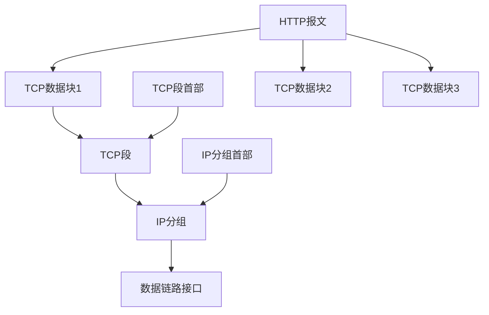

# http连接

by 菲尼莫斯 2019年3月18日

---

## TCP

### 基本

* TCP是可靠的比特传输管道：从一端填入的字节可以从另一端有序、正确地得到

* http报文数据以流的形式进入TCP管道

* TCP将收到的数据流分为小的TCP段

* TCP将TCP段封装到IP分组中

* IP分组直接通过数据链路接口传播

* https则是将通过TCP传送的数据先进行TSL/SSL加密

### 特性

* TCP是网络层协议，保证数据传输的有序、正确和可靠

* IP是传输层协议，负责寻址将数据发送到目的地

* 每个TCP段都有序列号和完整性校验和
  
* 每个TCP段的接收者收到TCP段后都必须向发送者回复确认信息，该确认信息可以捎带在数据分组中

* 若发送者在指定窗口时间内没收到确认信息，便默认分组损坏并重新发送

### 性能问题

* TCP慢启动：每成功接收一个分组，发送端才有发送另外两个分组的权限（即刚启动只能发一个分组，然后依次翻倍1 -> 2 -> 4 -> 8）

* 延迟确认算法：由于确认信息的数据量很小，所以确认信息会先等待一定时间，若期间有别的数据要发送，则确认信息会随该数据分组一同发送，否则才单独发送确认分组

* TCP_NODELAY：由于每个TCP段都包含40字节的标记和首部，因此鼓励一次发送最大量的数据以保证效率
    * nagle算法的规则是当其他所有TCP分组都被确认之后才能发送不全尺寸的分组
    * nagle算法可以在**上一个TCP分组等待确认时**，将接下来要发送的数据缓存起来，**累计到全尺寸**或者**上一个分组被确认时**，才发送下一个分组。
    * 1.nagle和延迟确认算法间存在冲突；2.对于小的报文会存在一个“白等”的缓存时间
    * nagle算法可以通过TCP_NODELAY中关闭

* TIME_WAIT：在关闭TCP连接后，会维护一个缓存（2倍MSL（最大分段试用期，即TCP分组在因特网队列中最长保留时间））记录所关闭连接的IP地址和端口，确保不会创建新的相同的连接。

### http请求过程

1. 解析主机名
2. 解析IP地址
3. 解析端口号
4. 建立TCP连接
5. 发送请求报文
6. 接收响应报文
7. 关闭连接

