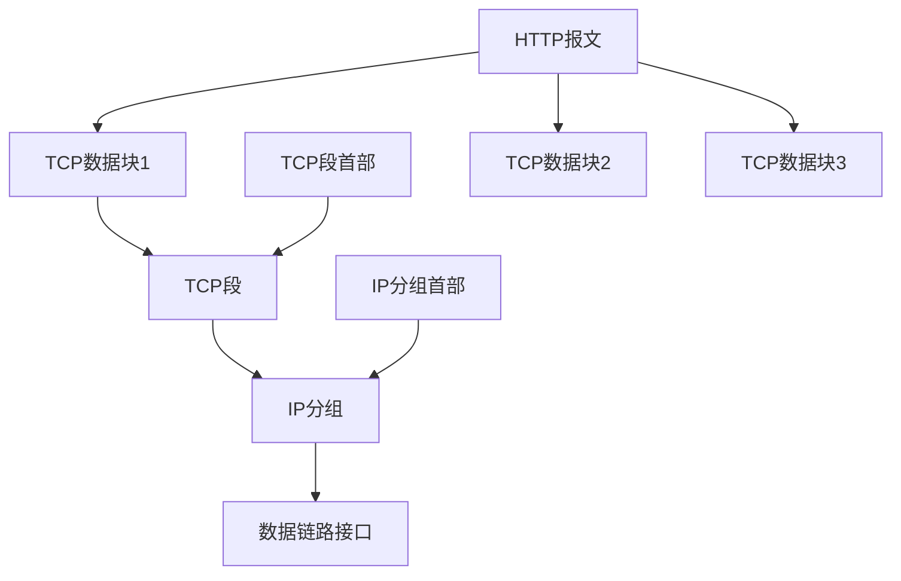

# http连接

by 菲尼莫斯 2019年3月18日

---

## TCP

可靠的比特传输管道：从一端填入的字节可以从另一端有序、正确地得到

http报文数据以流的形式进入TCP管道

TCP将收到的数据流分为小的TCP段

TCP将TCP段封装到IP分组中

IP分组直接通过数据链路接口传播

https则是将通过TCP传送的数据先进行TSL/SSL加密

### http请求过程

1. 解析主机名
2. 解析IP地址
3. 解析端口号
4. 建立TCP连接
5. 发送请求报文
6. 接收响应报文
7. 关闭连接

### http报文和TCP/IP的关系

TCP保证数据传输的有序、正确和可靠
IP负责寻址将数据发送到目的地

