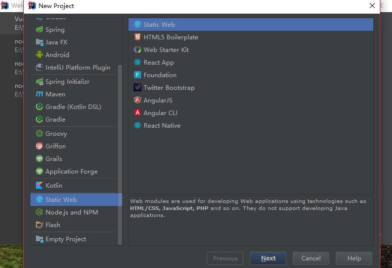
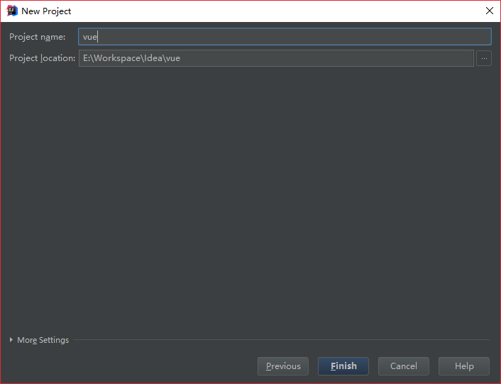
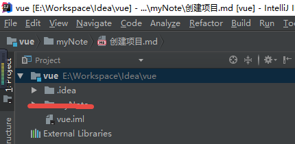
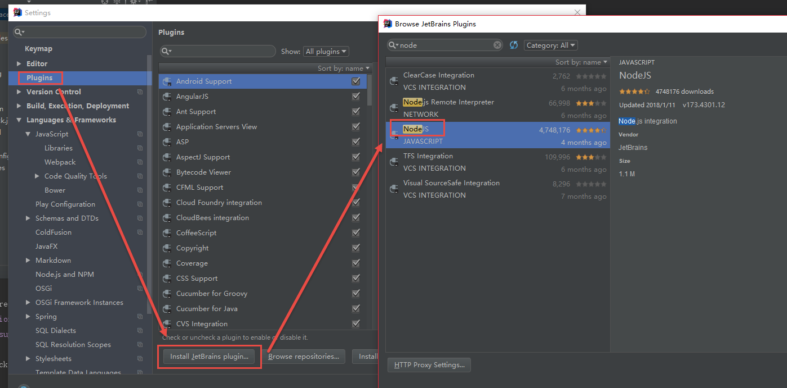
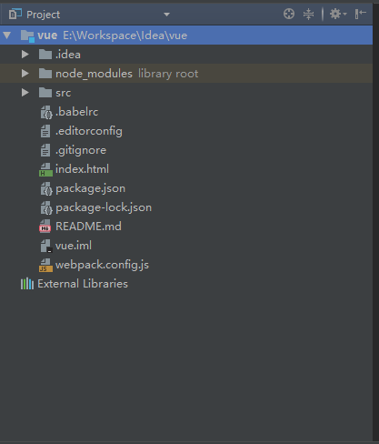
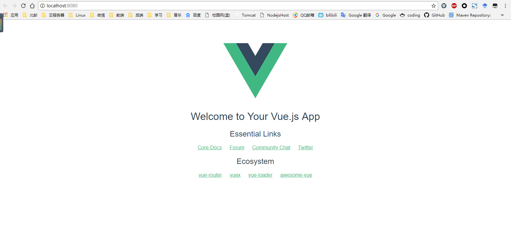

#用idea创建Vue项目

标签（空格分隔）： 前端

---
##1. 搭建一个简单工程
### 1.1 创建工程
1. 选择静态web项目



2. 给项目起个名



3. 目录结构如下：




### 1.2 安装vue-cli脚手架

在IDEA自带的命令行terminal中使用npm安装vue-cli脚手架：

```
> npm install vue-cli -g
```

### 1.3 构建工程

在IDEA自带的命令行terminal中输入如下命令：


### 1.4 生成npm项目

1. 输入如下命令：


2. 安装IDEA的node.js支持:



3. 启用Node.js类库


4. 目录结构如图所示：



### 1.5 试运行

1. 控制台输入：

```
> npm run install  #安装依赖模块
> npm run dev #运行项目
```

2. 展示效果：



## 2. 搭建一个webpack项目

### 1. 在控制台执行如下命令：
``` cmd
PS E:\Workspace\Idea> vue init webpack vueWebpack

? Target directory exists. Continue? Yes
'git' �����ڲ����ⲿ���Ҳ���ǿ����еij���
���������ļ���
? Project name vuewebpack
? Project description A Vue.js project
? Author Quwer
? Vue build standalone
? Install vue-router? Yes
? Use ESLint to lint your code? Yes
? Pick an ESLint preset Standard
? Set up unit tests Yes
? Pick a test runner karma
? Setup e2e tests with Nightwatch? Yes
? Should we run `npm install` for you after the project has been created? (recommended) no

   vue-cli · Generated "vueWebpack".

# Project initialization finished!
# ========================

To get started:

  cd vueWebpack
  npm install (or if using yarn: yarn)
  npm run lint -- --fix (or for yarn: yarn run lint --fix)
  npm run dev

Documentation can be found at https://vuejs-templates.github.io/webpack
```
### 2.生成的目录如下所示：

```
PS E:\Workspace\Idea\vueWebpack> tree /f
卷 Quwer Data 的文件夹 PATH 列表
卷序列号为 0001-9230
E:\Workspace\Idea\vueWebpack
│  .babelrc
│  .editorconfig
│  .eslintignore
│  .eslintrc.js
│  .gitignore
│  .postcssrc.js
│  index.html
│  package.json
│  README.md
│
├─build
│      build.js
│      check-versions.js
│      logo.png
│      utils.js
│      vue-loader.conf.js
│      webpack.base.conf.js
│      webpack.dev.conf.js
│      webpack.prod.conf.js
│      webpack.test.conf.js
│
├─config
│      dev.env.js
│      index.js
│      prod.env.js
│      test.env.js
│
├─src
│  │  App.vue
│  │  main.js
│  │
│  ├─assets
│  │      logo.png
│  │
│  ├─components
│  │      HelloWorld.vue
│  │
│  └─router
│          index.js
│
├─static
│      .gitkeep
│
└─test
    ├─e2e
    │  │  nightwatch.conf.js
    │  │  runner.js
    │  │
    │  ├─custom-assertions
    │  │      elementCount.js
    │  │
    │  └─specs
    │          test.js
    │
    └─unit
        │  .eslintrc
        │  index.js
        │  karma.conf.js
        │
        └─specs
                HelloWorld.spec.js
```

### 3.安装依赖模块：

**慎用cnpm install来进行安装，请尽量使用npm install**
```
E:\Workspace\Idea\vueWebpack>npm install
npm WARN deprecated socks@1.1.10: If using 2.x branch, please upgrade to at least 2.1.6 to avoid a serious bug with socket data flow and an import issue introduced in 2.1.0
npm WARN notice [SECURITY] parsejson has the following vulnerability: 1 high. Go here for more details: https://nodesecurity.io/advisories?search=parsejson&version=0.0.3 - Run `npm i npm@la
test -g` to upgrade your npm version, and then `npm audit` to get more info.
npm WARN notice [SECURITY] https-proxy-agent has the following vulnerability: 1 high. Go here for more details: https://nodesecurity.io/advisories?search=https-proxy-agent&version=1.0.0 - R
un `npm i npm@latest -g` to upgrade your npm version, and then `npm audit` to get more info.
npm WARN notice [SECURITY] http-proxy-agent has the following vulnerability: 1 high. Go here for more details: https://nodesecurity.io/advisories?search=http-proxy-agent&version=1.0.0 - Run
 `npm i npm@latest -g` to upgrade your npm version, and then `npm audit` to get more info.
npm WARN notice [SECURITY] growl has the following vulnerability: 1 critical. Go here for more details: https://nodesecurity.io/advisories?search=growl&version=1.9.2 - Run `npm i npm@latest
 -g` to upgrade your npm version, and then `npm audit` to get more info.

> phantomjs-prebuilt@2.1.16 install E:\Workspace\Idea\vueWebpack\node_modules\phantomjs-prebuilt
> node install.js

PhantomJS not found on PATH
Download already available at C:\Users\Quwer\AppData\Local\Temp\phantomjs\phantomjs-2.1.1-windows.zip
Verified checksum of previously downloaded file
Extracting zip contents
Removing E:\Workspace\Idea\vueWebpack\node_modules\phantomjs-prebuilt\lib\phantom
Copying extracted folder C:\Users\Quwer\AppData\Local\Temp\phantomjs\phantomjs-2.1.1-windows.zip-extract-1527497957468\phantomjs-2.1.1-windows -> E:\Workspace\Idea\vueWebpack\node_modules\p
hantomjs-prebuilt\lib\phantom
Writing location.js file
Done. Phantomjs binary available at E:\Workspace\Idea\vueWebpack\node_modules\phantomjs-prebuilt\lib\phantom\bin\phantomjs.exe

```
tips：安装过程若出现如下错误：
```
> chromedriver@2.38.3 install E:\Workspace\Idea\vueWebpack\node_modules\chromedriver
> node install.js

Downloading https://chromedriver.storage.googleapis.com/2.38/chromedriver_win32.zip
Saving to C:\Users\Quwer\AppData\Local\Temp\chromedriver\chromedriver_win32.zip
ChromeDriver installation failed Error with http(s) request: Error: connect ETIMEDOUT 172.217.160.112:443
npm WARN rollback Rolling back node-pre-gyp@0.10.0 failed (this is probably harmless): EPERM: operation not permitted, lstat 'E:\Workspace\Idea\vueWebpack\node_modules\fsevents\node_modules
'
npm WARN optional SKIPPING OPTIONAL DEPENDENCY: fsevents@1.2.4 (node_modules\fsevents):
npm WARN notsup SKIPPING OPTIONAL DEPENDENCY: Unsupported platform for fsevents@1.2.4: wanted {"os":"darwin","arch":"any"} (current: {"os":"win32","arch":"x64"})

npm ERR! code ELIFECYCLE
npm ERR! errno 1
npm ERR! chromedriver@2.38.3 install: `node install.js`
npm ERR! Exit status 1
npm ERR!
npm ERR! Failed at the chromedriver@2.38.3 install script.
npm ERR! This is probably not a problem with npm. There is likely additional logging output above.

npm ERR! A complete log of this run can be found in:
npm ERR!     C:\Users\Quwer\AppData\Roaming\npm-cache\_logs\2018-05-28T08_59_41_629Z-debug.log
```
可以从其他地址另行安装chromeDriver:
```
E:\Workspace\Idea\vueWebpack>npm install chromedriver --chromedriver_cdnurl=http://cdn.npm.taobao.org/dist/chromedriver

> chromedriver@2.38.3 install E:\Workspace\Idea\vueWebpack\node_modules\chromedriver
> node install.js

Downloading http://cdn.npm.taobao.org/dist/chromedriver/2.38/chromedriver_win32.zip
Saving to C:\Users\Quwer\AppData\Local\Temp\chromedriver\chromedriver_win32.zip
Received 782K...
Received 1564K...
Received 2347K...
Received 3129K...
Received 3299K total.
Extracting zip contents
Copying to target path E:\Workspace\Idea\vueWebpack\node_modules\chromedriver\lib\chromedriver
Done. ChromeDriver binary available at E:\Workspace\Idea\vueWebpack\node_modules\chromedriver\lib\chromedriver\chromedriver.exe
npm WARN rollback Rolling back readable-stream@2.3.6 failed (this is probably harmless): EPERM: operation not permitted, lstat 'E:\Workspace\Idea\vueWebpack\node_modules\fsevents\node_modul
es'
npm notice created a lockfile as package-lock.json. You should commit this file.
npm WARN optional SKIPPING OPTIONAL DEPENDENCY: fsevents@1.2.4 (node_modules\fsevents):
npm WARN notsup SKIPPING OPTIONAL DEPENDENCY: Unsupported platform for fsevents@1.2.4: wanted {"os":"darwin","arch":"any"} (current: {"os":"win32","arch":"x64"})

+ chromedriver@2.38.3
added 1 package in 15.405s

```

###4. 运行项目

```
E:\Workspace\Idea\vueWebpack>npm run dev
```

若出现如下错误：
```
> vuewebpack@1.0.0 dev E:\Workspace\Idea\vueWebpack
> webpack-dev-server --inline --progress --config build/webpack.dev.conf.js

 94% asset optimization

 ERROR  Failed to compile with 2 errors                                                                                                                                              17:11:44

 error  in ./src/App.vue

Module build failed: Error: No parser and no file path given, couldn't infer a parser.
    at normalize (E:\Workspace\Idea\vueWebpack\node_modules\prettier\index.js:7051:13)
    at formatWithCursor (E:\Workspace\Idea\vueWebpack\node_modules\prettier\index.js:10370:12)
    at E:\Workspace\Idea\vueWebpack\node_modules\prettier\index.js:31115:15
    at Object.format (E:\Workspace\Idea\vueWebpack\node_modules\prettier\index.js:31134:12)
    at Object.module.exports (E:\Workspace\Idea\vueWebpack\node_modules\vue-loader\lib\template-compiler\index.js:80:23)

 @ ./src/App.vue 11:0-354
 @ ./src/main.js
 @ multi (webpack)-dev-server/client?http://localhost:8080 webpack/hot/dev-server ./src/main.js

 error  in ./src/components/HelloWorld.vue

Module build failed: Error: No parser and no file path given, couldn't infer a parser.
    at normalize (E:\Workspace\Idea\vueWebpack\node_modules\prettier\index.js:7051:13)
    at formatWithCursor (E:\Workspace\Idea\vueWebpack\node_modules\prettier\index.js:10370:12)
    at E:\Workspace\Idea\vueWebpack\node_modules\prettier\index.js:31115:15
    at Object.format (E:\Workspace\Idea\vueWebpack\node_modules\prettier\index.js:31134:12)
    at Object.module.exports (E:\Workspace\Idea\vueWebpack\node_modules\vue-loader\lib\template-compiler\index.js:80:23)

 @ ./src/components/HelloWorld.vue 11:0-366
 @ ./src/router/index.js
 @ ./src/main.js
 @ multi (webpack)-dev-server/client?http://localhost:8080 webpack/hot/dev-server ./src/main.js
```
错误原因为：prettier模块的1.13.0版本删除了1.12中的一些内容，导致程序无法运行，我们需要把prettier回滚至1.12

**慎用cnpm install 操作不慎将会导致回滚失败，从而需要重新安装项目**
```
E:\Workspace\Idea\vueWebpack>npm install prettier@~1.12.1
npm WARN optional SKIPPING OPTIONAL DEPENDENCY: fsevents@1.2.4 (node_modules\fsevents):
npm WARN notsup SKIPPING OPTIONAL DEPENDENCY: Unsupported platform for fsevents@1.2.4: wanted {"os":"darwin","arch":"any"} (current: {"os":"win32","arch":"x64"})

+ prettier@1.12.1
updated 1 package in 11.715s

```
### 5.之后项目便可以使用了：

```
E:\Workspace\Idea\vueWebpack>npm run dev

> vuewebpack@1.0.0 dev E:\Workspace\Idea\vueWebpack
> webpack-dev-server --inline --progress --config build/webpack.dev.conf.js

 95% emitting

 DONE  Compiled successfully in 3261ms                                                                                                                                               17:19:29

 I  Your application is running here: http://localhost:8080
```
